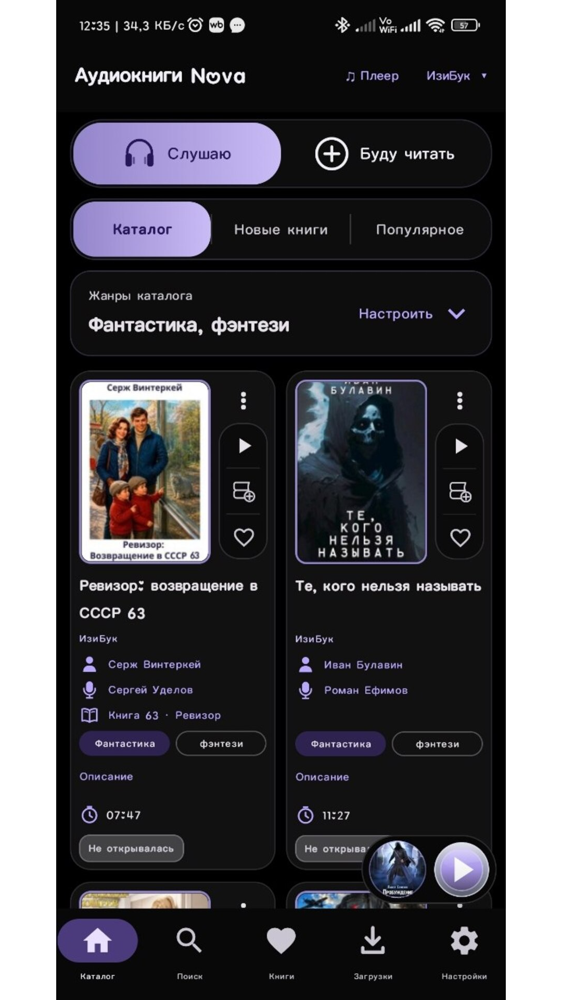
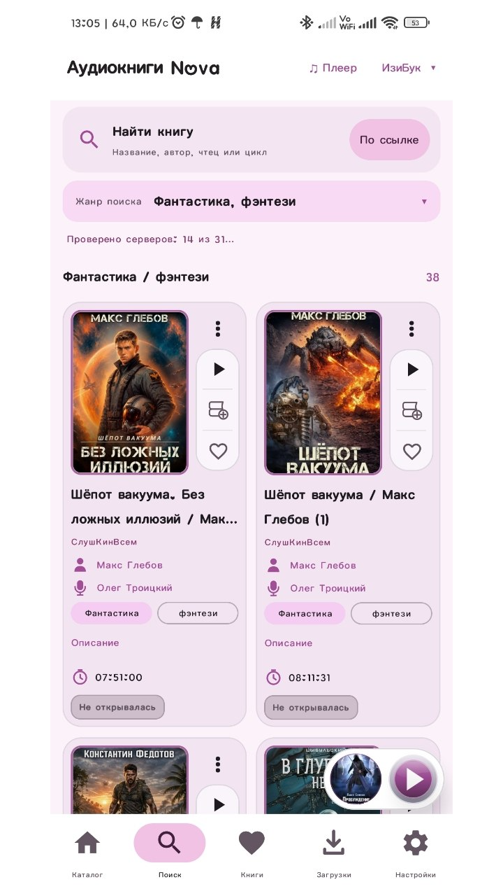
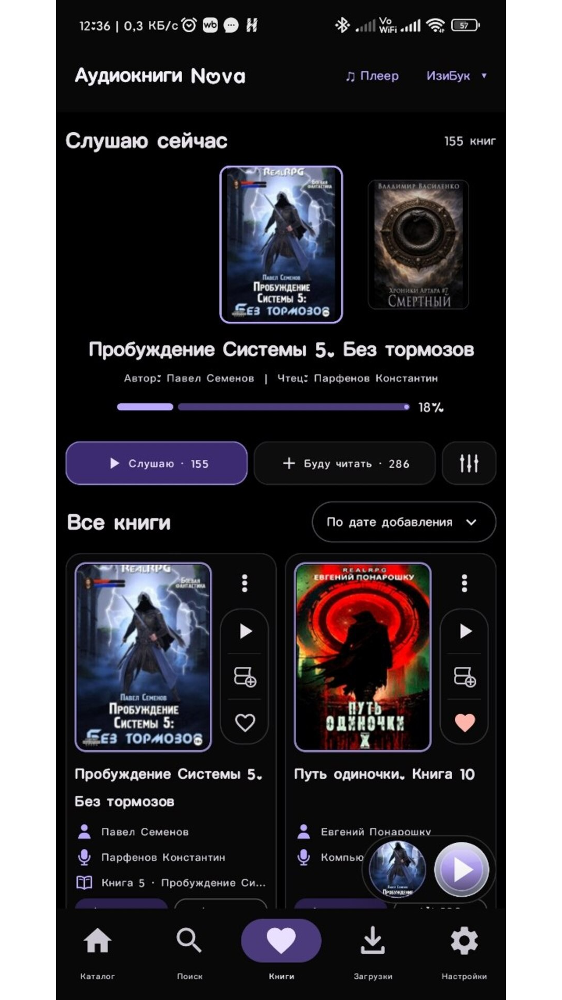
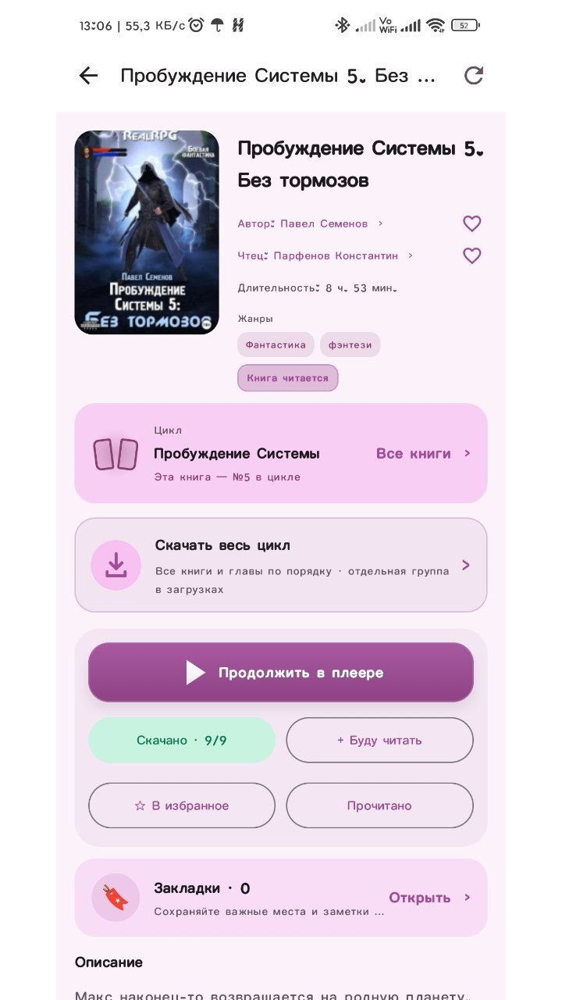
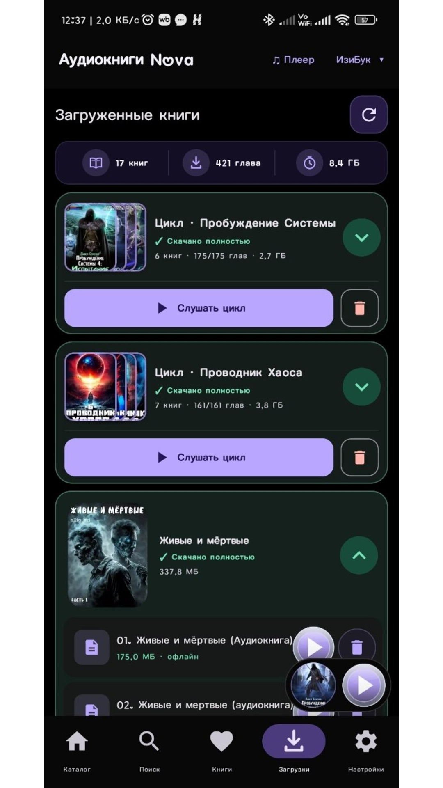
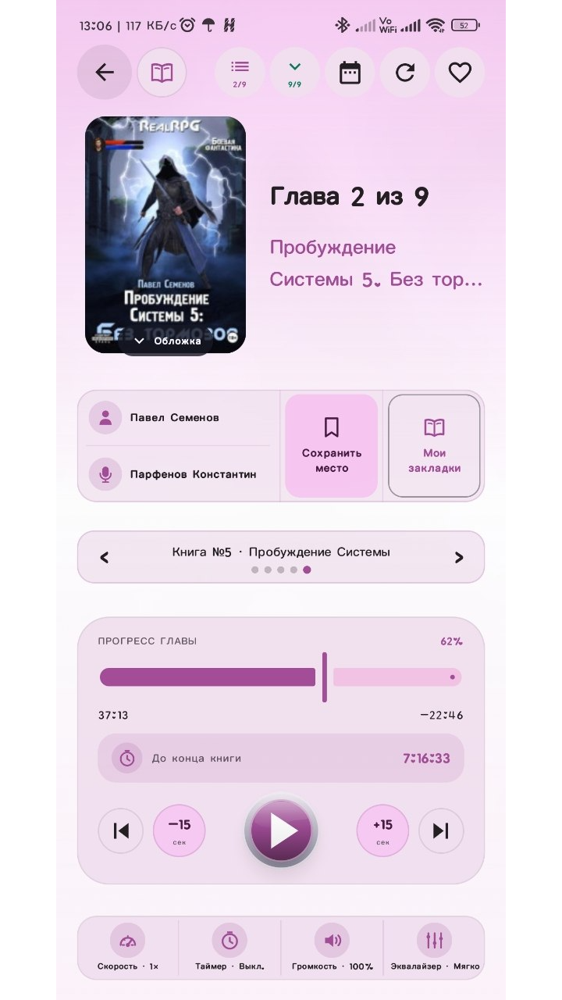
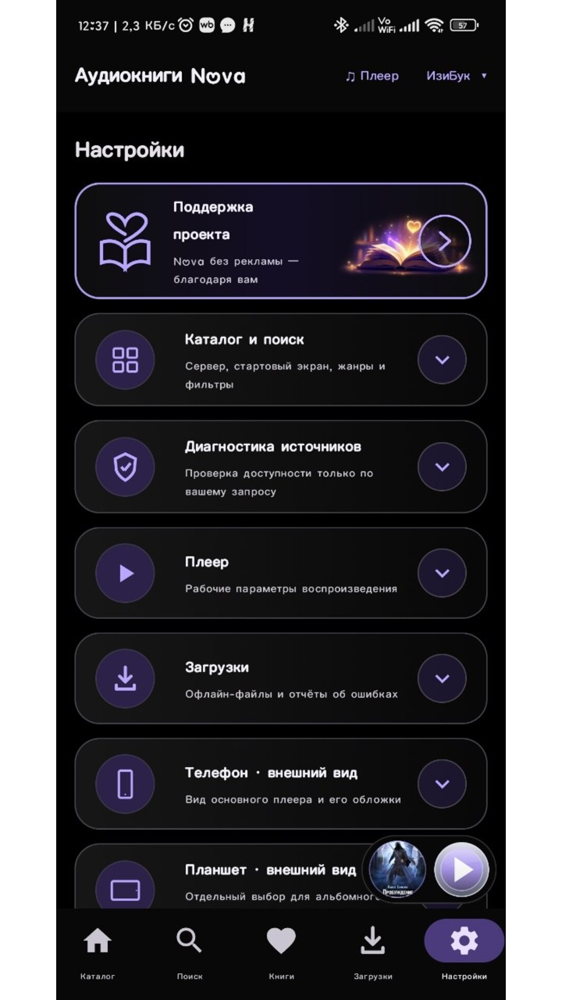

# Аудиокниги Nova

Бесплатное Android-приложение для поиска, онлайн-прослушивания и офлайн-загрузки аудиокниг из открытых источников.

Исходный код разрабатывается в закрытом репозитории. Здесь публикуются описание, контрольные суммы и подписанные APK-релизы, доступные всем пользователям.

- Разработчик: **Schroedinger's cat** (`SroedingerS` на GitHub)
- Имя пакета: `org.audioknigi.nova`
- Требуется Android: 6.0 и выше

## Скачать

Откройте раздел **Releases** и выберите последний файл `AudiobooksNova-*.apk`. Для обновления поверх установленной Nova цифровая подпись APK должна совпадать.

Актуальная версия: **2.9.1u**. Улучшены подгрузка страниц при ошибках источников, разбор каталога AudioBoo, загрузка обложек и работа с крупными шрифтами; объединено поведение переключателей. [Описание изменений](RELEASE-2.9.1u.md) · [Скачать APK](https://github.com/SroedingerS/AudiobooksNova-Releases/releases/download/v2.9.1u/AudiobooksNova-2.9.1u.apk).

Минимальная версия: Android 6.0 (API 23). Поддерживаются телефоны, планшеты и Android TV, книжная и альбомная ориентации.

## Основные возможности

- каталог и поиск по одному или нескольким бесплатным источникам;
- библиотека: слушаю, буду читать, избранное, прочитано и история;
- полноэкранный и мини-плеер, главы, умный таймер сна с расписанием и продлением встряхиванием, скорость, громкость и аудиофокус;
- компактная настройка звука: эквалайзер, высота голоса и аккуратное сокращение только длинной тишины;
- устойчивое онлайн-воспроизведение без перехода на следующую главу при сетевой ошибке;
- офлайн-загрузка глав и книг с управляемой параллельной очередью;
- локальные сторонние аудиокниги из выбранной папки;
- добавление поддерживаемой публичной аудиокниги по ссылке;
- резервные копии и синхронизация через Google Диск или Яндекс Диск;
- независимые светлая/тёмная палитры, пользовательский цвет, размеры шрифта и виджеты;
- меню книги по долгому нажатию и интерфейс с полноценной навигацией с пульта Android TV.

## Скриншоты

| Каталог | Поиск | Карточка книги |
|---|---|---|
|  |  |  |

| Библиотека | Плеер | Настройки |
|---|---|---|
|  |  |  |

## Обновления

Nova тихо проверяет этот публичный репозиторий при запуске и сообщает только о реально доступной новой версии. Автоматическое предложение показывается не более трёх раз для одного релиза; ручная проверка остаётся в настройках. После установки каждой версии краткий пронумерованный список изменений показывается один раз.

APK проверяется по SHA-256 (если GitHub публикует digest), имени пакета, более новому номеру версии и цифровой подписи. Установку всегда подтверждает системное окно Android — скрытая установка обычному приложению недоступна.

## Конфиденциальность

Nova не содержит рекламы и аналитических SDK, не требует регистрации для основной работы. Подробности: [PRIVACY.md](PRIVACY.md).

## Обратная связь

Обсуждение приложения и инструкции по установке доступны в [официальной теме 4PDA](https://4pda.to/forum/index.php?showtopic=1125822).

Приложение не хранит книги на GitHub. Доступность каталога, обложек и аудиофайлов зависит от выбранного внешнего источника и его правил.
